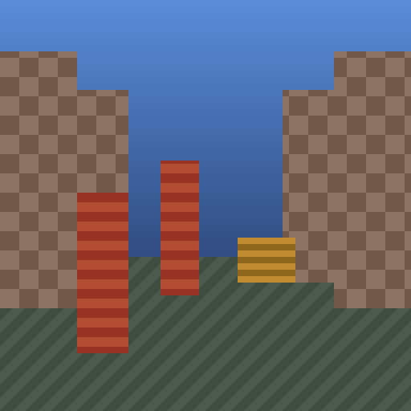
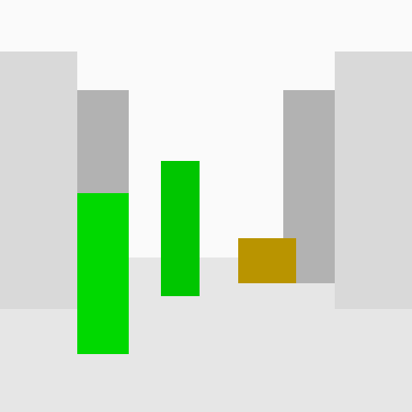

# mirror

A Vulkan layer that replaces a game's materials with a depth-only view:
every surface is drawn as grayscale depth (closer = darker), and any material
you choose can be highlighted in a contrasting color — for example players or
chests.

| Normal | Depth mode | Depth + highlights |
| --- | --- | --- |
|  |  |  |

Why you might want this:

- **Accessibility.** A high-contrast, texture-free image is easier to read
  for people with low vision or color-vision deficiencies. Important objects
  can be given fixed, vivid colors.
- **Graphics debugging.** Seeing the depth structure of a frame and isolating
  individual materials is a classic debugging aid.
- **Simplicity.** Visual noise from textures, fog and decoration disappears;
  only geometry remains.

> **Fair play note.** The visualization fully respects the application's
> depth test — highlighted objects are *not* visible through walls, and no
> hidden information is revealed. Still, only use the layer with games whose
> rules allow render modifications, or in single-player.

## How it works

`VK_LAYER_MIRROR_mirror` sits between the application and the Vulkan driver:

1. `vkCreateShaderModule` — every shader module is fingerprinted with a
   64-bit FNV-1a hash of its SPIR-V code. That hash *is* the material
   identity used for highlighting.
2. `vkCreateGraphicsPipelines` — the application's fragment stage is swapped
   for an embedded shader that outputs `gl_FragCoord.z` as grayscale, or the
   configured highlight color (shaded by depth) when the original fragment
   shader's hash matches a `MIRROR_HIGHLIGHT` entry. The mode and color are
   passed through specialization constants, so no descriptors, push
   constants, or extra memory are involved.

Everything else passes straight through to the driver. The replacement
shader consumes no resources of its own, so it is compatible with arbitrary
pipeline layouts.

## Building

Requirements: a Rust toolchain ≥ 1.77 (`cargo`), the Vulkan loader, and
`glslangValidator` (package `glslang-tools`) to compile the embedded shaders.
For headless testing, the lavapipe CPU driver (`mesa-vulkan-drivers`) works.

```sh
cargo build --release
```

This produces the layer shared object `target/release/libmirror.so`. Generate
a loader manifest pointing at it (adjust the absolute path):

```sh
cat > VkLayer_MIRROR_mirror.json <<EOF
{
  "file_format_version": "1.2.0",
  "layer": {
    "name": "VK_LAYER_MIRROR_mirror",
    "type": "GLOBAL",
    "library_path": "$(pwd)/target/release/libmirror.so",
    "api_version": "1.3.0",
    "implementation_version": "1",
    "description": "Renders depth instead of materials, with configurable highlights"
  }
}
EOF
```

## Usage

Point the loader at the manifest directory and enable the layer:

```sh
export VK_ADD_LAYER_PATH=/path/to/manifest-dir
export VK_INSTANCE_LAYERS=VK_LAYER_MIRROR_mirror
./your-game
```

### Configuration

| Variable | Values | Default | Meaning |
| --- | --- | --- | --- |
| `MIRROR_MODE` | `depth`/`on`/`1`, `off`/`none`/`0` | `depth` | Depth visualization or passthrough |
| `MIRROR_HIGHLIGHT` | `<hash>=<RRGGBB>[,<hash>=<RRGGBB>...]` | empty | Materials to highlight, by shader hash |
| `MIRROR_LOG` | `0`/`1` | `0` | Log layer activity to stderr |

### Finding material hashes

Run once with logging enabled:

```sh
MIRROR_LOG=1 VK_INSTANCE_LAYERS=VK_LAYER_MIRROR_mirror ./your-game 2>&1 | grep hash=
```

Every created shader module is printed as `hash=<16 hex digits>`. Pick the
hashes of the materials you care about and assign colors:

```sh
export MIRROR_HIGHLIGHT=4af9203c828fcd45=00ff00,9c01b6a2dd6ef2b3=ffcc00
```

## Development

```sh
cargo test --workspace      # unit + headless integration tests
cargo fmt --all -- --check  # formatting
cargo clippy --workspace --all-targets -- -D warnings
```

The integration tests build the layer, register it with the loader
automatically, render real scenes through it on any Vulkan device (lavapipe
is enough) and check pixel-exact results — including a run under
`VK_LAYER_KHRONOS_validation` that must produce zero validation errors. On a
machine without a Vulkan device the render scenarios skip cleanly. Point the
loader at lavapipe for headless runs:

```sh
export VK_ICD_FILENAMES=/usr/share/vulkan/icd.d/lvp_icd.json XDG_RUNTIME_DIR=/tmp
```

The example that produced the screenshots above builds and registers the
layer itself, so it needs no `VK_ADD_LAYER_PATH`:

```sh
cargo run --release --example scene -- docs/screenshots
```

## Limitations and roadmap

- Replacing fragment shaders removes texture *sampling* work but does not by
  itself evict textures from VRAM — the application still creates and
  uploads its resources. Actually reducing VRAM (e.g. substituting dummy
  images at `vkCreateImage` time) is the next planned step and needs
  per-game care.
- Compute, ray-tracing, and mesh-shader pipelines pass through unmodified.
- Pipelines created with `VK_KHR_pipeline_library` parts are not patched.
- Material identity is per shader module; games that select textures
  dynamically inside one übershader will appear as a single material.

## License

[MIT](LICENSE)
